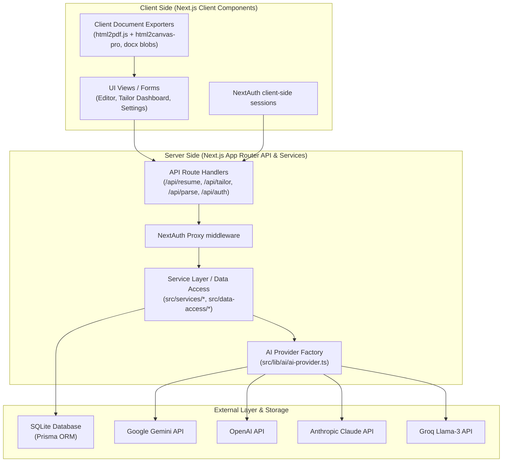
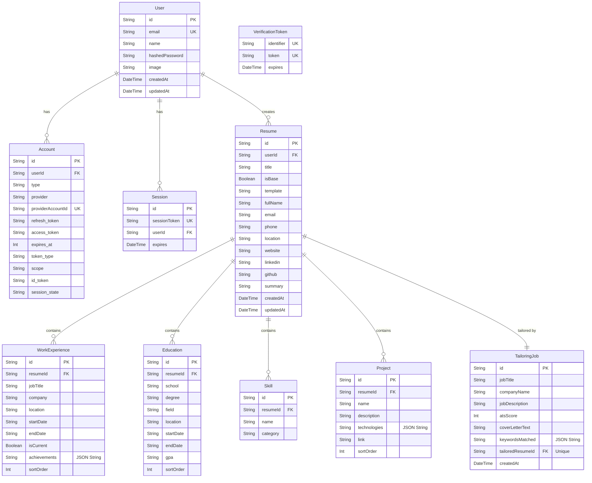

# AI Resume Builder & Tailoring Platform

A feature-rich, Next.js 16 application designed to construct base resumes, parse uploaded files with AI, tailor resumes to matching job descriptions, evaluate ATS scoring, and export professionally formatted documents (PDF and Microsoft Word).

---

## 🏗️ System Architecture

The application is structured into an **N-Tier Architecture**, decoupling client-side user interfaces, server route controllers, business logic service classes, and data access layers. AI interactions are managed by an abstract provider factory supporting multiple models (Gemini, OpenAI, Claude, Groq).



---

## 🗄️ Database ER Diagram

The database uses SQLite managed through Prisma ORM. The schema consists of two domains: NextAuth session management models and Resume domain models (supporting tailoring jobs, projects, skills, education, and experiences).



---

## 🚀 Key Features

* **AI Provider Abstraction Layer**: Switch models dynamically between Gemini (`gemini-2.0-flash`), OpenAI (`gpt-4o-mini`), Claude (`claude-3-5-sonnet`), and Groq (`llama-3.3-70b`) using request headers or `.env` configs.
* **Smart PDF Export**: Utilizes a customized postinstall-patched UMD mapping of `html2canvas-pro` loaded inside `html2pdf.js` to correctly render Tailwind CSS v4 color formats (e.g. `oklch()`, `lab()`) without runtime client crashes.
* **MS Word Layout Fidelity**: Dynamically parses the resume preview DOM to reconstruct visual column sidebars and grids into native HTML tables, replacing SVGs with unicode characters (`✉`, `📞`, `📍`, `🌐`, `LinkedIn:`, `GitHub:`) for maximum fidelity inside Microsoft Word.
* **Resilient Prisma Schema Mapping**: Features SQLite-safe schema writes converting arrays into JSON strings, defaulting null-like LLM parameters to compliant fallbacks, and parsing string integers to database fields.

---

## 🛠️ Getting Started

### 1. Prerequisites
* Node.js v20+
* NPM, Yarn, or PNPM

### 2. Environment Configuration
Create a `.env` (or `.env.local` for local development) file in the root folder:

```bash
# Database Configuration
DATABASE_URL="file:./dev.db"

# NextAuth Configuration
NEXTAUTH_URL="http://localhost:3000"
NEXTAUTH_SECRET="your_nextauth_secret_hash"

# AI Provider Configuration
# Options: "gemini" | "openai" | "anthropic" | "groq"
AI_PROVIDER="gemini"

# Provider Keys
GEMINI_API_KEY="your_google_gemini_api_key"
OPENAI_API_KEY="your_openai_api_key"
ANTHROPIC_API_KEY="your_anthropic_claude_api_key"
GROQ_API_KEY="your_groq_api_key"
```

### 3. Install & Build
Run install (which runs the automated `html2canvas` module patching hook):
```bash
npm install
```

Generate the local Prisma client and apply schema migrations:
```bash
npx prisma migrate dev
```

### 4. Running Locally
Start the development server:
```bash
npm run dev
```

### 5. Production Build
Verify compilation and launch the optimized build:
```bash
npm run build
npm run start
```
