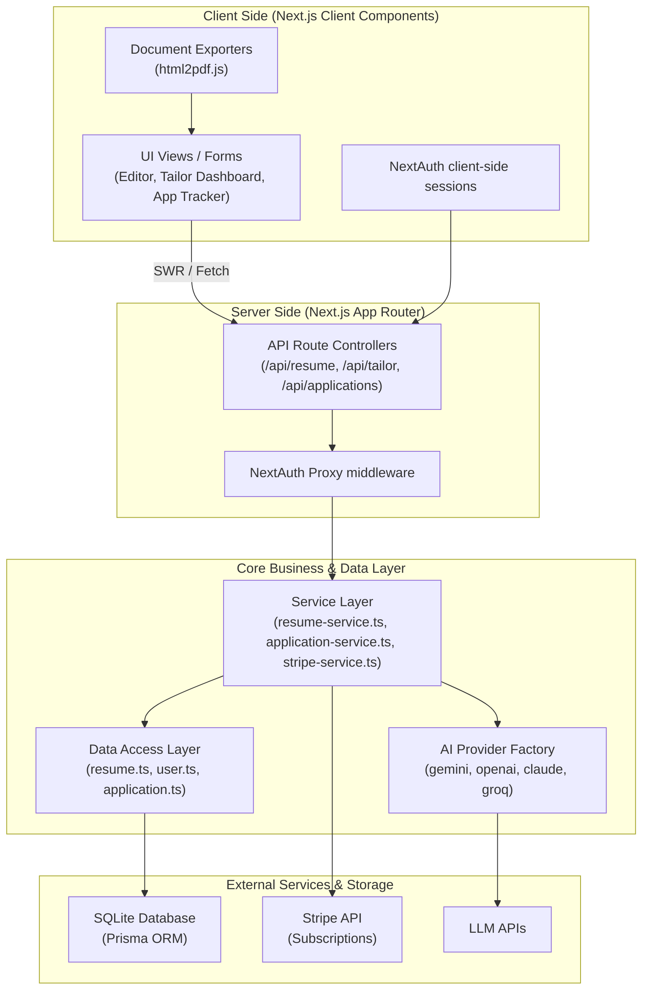
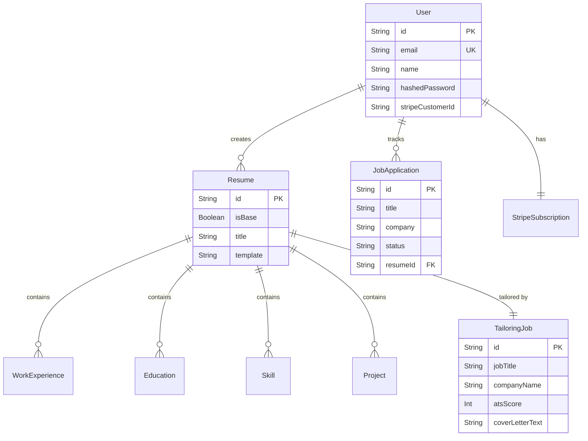

# AI Resume Builder & Tailoring Platform

A feature-rich, Next.js 16 application designed to construct base resumes, parse uploaded files with AI, tailor resumes to matching job descriptions, evaluate ATS scoring, track job applications, and export professionally formatted documents (PDF and Microsoft Word).

---

## 🚀 Features

* **Smart Resume Parsing**: Upload existing PDF or Word resumes and let AI extract all your information into a structured builder.
* **AI Resume Tailoring**: Enter a target job title, company, and description, and let AI rewrite your resume to maximize relevance and ATS compatibility.
* **ATS Score Evaluation**: Get instant feedback on how well your tailored resume matches the job description with a generated ATS score and keyword matching analysis.
* **Auto-generated Cover Letters**: Automatically generate personalized cover letters for every tailored resume.
* **Job Application Tracker**: Manage your job search pipeline. Applications are automatically tracked when you tailor a resume, or you can add them manually.
* **Multi-Format Export**: Export your resume as a print-ready PDF, an editable Microsoft Word document, or format it for LinkedIn.
* **AI Provider Flexibility**: Switch models dynamically between Gemini (`gemini-2.0-flash`), OpenAI (`gpt-4o-mini`), Claude (`claude-3-5-sonnet`), and Groq (`llama-3.3-70b`) via settings or `.env`.
* **Premium Design System**: Built with modern web aesthetics using dark modes, glassmorphism, gradient text, and micro-animations.
* **Stripe Subscription Billing**: Integrated Stripe checkout for Pro plan upgrades.

---

## 🏗️ System Architecture

The application is strictly structured into an **N-Tier Architecture**, decoupling client-side user interfaces, server route controllers, business logic service classes, and data access layers to ensure maintainability and separation of concerns.

### Visual Architecture



---

## 🗄️ Database ER Diagram

The database uses SQLite managed through Prisma ORM.



---

## 📚 Tools & Libraries Used

### Core Stack
- **Framework**: [Next.js 16](https://nextjs.org/) (App Router, Turbopack)
- **Language**: [TypeScript](https://www.typescriptlang.org/)
- **Styling**: [Tailwind CSS v4](https://tailwindcss.com/)
- **Database**: [SQLite](https://www.sqlite.org/) via [Prisma ORM](https://www.prisma.io/)

### UI & Aesthetics
- **Components**: [shadcn/ui](https://ui.shadcn.com/) and [Base UI](https://base-ui.com/) primitives (Tooltip, DropdownMenu).
- **Icons**: [Lucide React](https://lucide.dev/)
- **Notifications**: [Sonner](https://sonner.emilkowal.ski/)
- **Animations**: `tw-animate-css` for micro-interactions and enter/exit animations.

### AI & Integrations
- **AI Models**: `@google/generative-ai` (Gemini), with abstract support for OpenAI, Anthropic, and Groq.
- **Payments**: `stripe` and `@stripe/stripe-js` for subscription handling.
- **Authentication**: `next-auth` (Credentials provider with `bcryptjs`).

### Utilities
- **Document Parsing**: `pdf-parse` (PDF extraction) and `mammoth` (DOCX extraction).
- **Document Export**: `html2pdf.js` with `html2canvas-pro` (Print-ready PDF generation).
- **Data Validation**: `zod` for API payload validation.
- **Data Fetching**: `swr` for client-side state management and caching.

---

## 📖 How to Use

1. **Sign Up / Login**
   Create an account using your email and password. Your data is securely hashed and stored locally.

2. **Create a Base Resume**
   Navigate to the **Dashboard** and either:
   - Click "Create New Resume" to start from scratch using the manual builder.
   - Click "Upload Resume" to let AI extract your work history, education, and skills from an existing PDF or Word document.

3. **Tailor for a Job**
   - Once your base resume is ready, click **Tailor**.
   - Paste the Job Title, Company Name, and the Job Description.
   - The AI will rewrite your summary, bullet points, and skills to match the job requirements, generating an **ATS Score** and identifying missing keywords.

4. **Review & Export**
   - Review your tailored resume and auto-generated cover letter.
   - Export it directly as a PDF or Word document.

5. **Track Your Application**
   - Tailored resumes are automatically added to your **Job Applications** tracker.
   - Visit the Applications page to move your pipeline status from "Applied" to "Interview" or "Offer".

6. **Manage Settings**
   - Go to Settings to upgrade your plan via Stripe, manage your profile, or configure custom AI provider API keys if you prefer using your own LLM endpoints.

---

## 🛠️ Getting Started Locally

### 1. Prerequisites
* Node.js v20+
* NPM, Yarn, or PNPM

### 2. Environment Configuration
Create a `.env.local` file in the root folder:

```bash
# Database
DATABASE_URL="file:./dev.db"

# NextAuth
NEXTAUTH_URL="http://localhost:3000"
NEXTAUTH_SECRET="your_nextauth_secret_hash"

# Stripe (Optional for local dev)
STRIPE_SECRET_KEY="sk_test_..."
STRIPE_PRO_PRICE_ID="price_..."
NEXT_PUBLIC_APP_URL="http://localhost:3000"

# AI Provider Configuration
AI_PROVIDER="gemini"
GEMINI_API_KEY="your_google_gemini_api_key"
```

### 3. Install & Build
```bash
# Install dependencies
npm install

# Initialize database schema
npx prisma db push
```

### 4. Run Development Server
```bash
npm run dev
```
Open `http://localhost:3000` in your browser.
